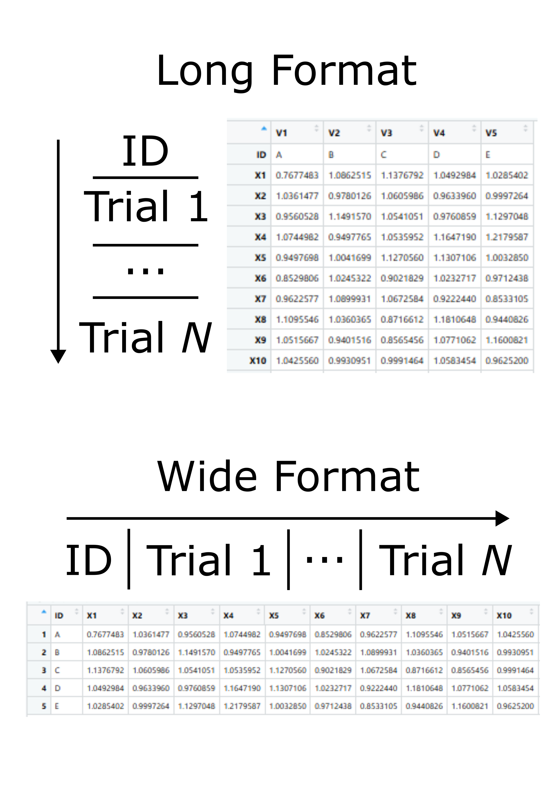

<!-- README.md is generated from README.Rmd. Please edit that file -->

# SRTTAnalysis

<!-- badges: start -->

<!-- badges: end -->

This package includes a set of functions to analyse raw reaction time
data (e.g., SRTT), calculate performance and plot the results of this
analysis

## Installation

You can install the development version of SRTTAnalysis from
[GitHub](https://github.com/) with:

``` r
# install.packages("pak")
pak::pak("albertooof/SRTTAnalysis")
```

You can also install the development version of SRTTAnalysis from
[GitHub](https://github.com/) with:

``` r
# install.packages("devtools")
devtools::install_github("albertooof/SRTTAnalysis")
```

## Types of Dataframe expected as input



## Example

Basic examples which show you how to run the code and what output to
expect:

``` r
library(SRTTAnalysis)

data_wide <- data.frame(id = 999, t(rnorm(500, mean = 1, sd = 0.1)))
head(SRTT_analysis(data_wide, format = "Wide")[, 1:10])
#>       ID       V2      V3       V4       V5       V6       V7       V8       V9
#> SRTT 999 1152.369 1000.25 897.5609 980.3708 916.4761 863.8126 1057.595 976.3554
#>           V10
#> SRTT 1062.763
```

``` r

data_long <- data.frame(value = c(999, rnorm(500, mean = 1, sd = 0.1)))
head(SRTT_analysis(data_long, format = "Long")[, 1:10])
#>       ID       V2      V3       V4       V5       V6       V7       V8      V9
#> SRTT 999 1006.974 1066.67 861.5098 895.3682 988.6113 1100.555 1073.861 940.689
#>           V10
#> SRTT 1169.041
```

``` r
ID <- LETTERS[1:10]

dataframe_wide <- data.frame(ID = ID, matrix(stats::rnorm(10 * 500, mean = 1, sd = 0.1), nrow = 10, ncol = 500) )

head(SRTT_analysis_for_Dataframes(dataframe_wide, format = "Wide")[, 1:10]) 
#>       ID               V2               V3               V4               V5
#> SRTT   A 818.896916404392 1222.58668896078 1077.12923398918  927.92568677561
#> SRTT1  B 1041.53960890203 1080.69650965251 1057.88759989272 1126.71299818481
#> SRTT2  C 1082.34900730365 1057.40623298948  982.27017267762 997.653960102948
#> SRTT3  D 789.051513123102 1004.77293788321 806.408462190685 1155.98553360193
#> SRTT4  E 1065.58419855801 957.989955624147 1197.12324563655 1137.82669738622
#> SRTT5  F 802.623180206277 876.863424984973 1042.65688449696  1092.4110398663
#>                     V6               V7               V8               V9
#> SRTT  1008.59003896326 997.623938847213 867.485071725581 1213.55689090997
#> SRTT1 1058.69343492221 1022.94888791066 955.790741938495 1077.93903416283
#> SRTT2 970.422940871288 1052.06225554568 1080.26284114948 941.355891561619
#> SRTT3 998.114687244973 1128.88521430739 1007.75936637602 896.514153015148
#> SRTT4 942.672023428845 1216.38643321785 905.994533641341 758.385105480756
#> SRTT5 1080.64910444016 945.281132381631 1023.97561374041  1176.2240782706
#>                    V10
#> SRTT  978.168255863849
#> SRTT1             <NA>
#> SRTT2             <NA>
#> SRTT3 986.278378969678
#> SRTT4 1252.11731413572
#> SRTT5  1046.8283130771
```

``` r

dataframe_long <- as.data.frame(t(dataframe_wide))

head(SRTT_analysis_for_Dataframes(dataframe_long, format = "Long" ,running_window_width_percentage = 0.3)[, 1:10]) 
#>       ID        V2        V3        V4        V5        V6        V7        V8
#> SRTT   A  818.8969 1222.5867 1077.1292  927.9257   1008.59  997.6239  867.4851
#> SRTT1  B 1041.5396 1080.6965 1057.8876  1126.713 1058.6934 1022.9489  955.7907
#> SRTT2  C  1082.349 1057.4062  982.2702   997.654  970.4229 1052.0623 1080.2628
#> SRTT3  D  789.0515 1004.7729  806.4085 1155.9855  998.1147 1128.8852 1007.7594
#> SRTT4  E 1065.5842    957.99 1197.1232 1137.8267   942.672 1216.3864  905.9945
#> SRTT5  F  802.6232  876.8634 1042.6569  1092.411 1080.6491  945.2811 1023.9756
#>              V9       V10
#> SRTT  1213.5569  978.1683
#> SRTT1  1077.939      <NA>
#> SRTT2  941.3559      <NA>
#> SRTT3  896.5142  986.2784
#> SRTT4  758.3851 1252.1173
#> SRTT5 1176.2241 1046.8283
```

``` r
random_values <- stats::rnorm(1200, mean = 1, sd = 0.1)

num_nas <- sample(50:150, 1)

random_values[sample(1200, num_nas)] <- NA

random_list_w <- data.frame(ID = 999, t(random_values))

percentage_of_filtered_values(random_list_w, format = "Wide", number_of_rounds = 3,  rounds_of_equal_length = FALSE, design = c(50 , 180, 50, 50, 300, 50, 50 , 180, 50, 50 , 180, 50))
#>    ID preRND_1  Train_1 postRND_1  Skill_1 preRND_2  Train_2 postRND_2 Skill_2
#> 1 999       10 9.444444        10 9.642857       14 11.33333         8   11.25
#>   preRND_3  Train_3 postRND_3  Skill_3
#> 1        4 11.11111         8 9.285714
```

``` r
random_list_l <- as.data.frame(t(random_list_w))

percentage_of_filtered_values(random_list_l, format = "Long", number_of_rounds = 3,  rounds_of_equal_length = TRUE, design = c(40, 300, 60))
#>    ID preRND_1 Train_1 postRND_1 Skill_1 preRND_2  Train_2 postRND_2 Skill_2
#> 1 999     12.5      10  11.66667    10.5      7.5 9.666667        10     9.5
#>   preRND_3  Train_3 postRND_3 Skill_3
#> 1       15 10.66667  6.666667    10.5
```

``` r
random_matrix <- matrix(stats::rnorm(10 * 1200, mean = 1, sd = 0.1), nrow = 10, ncol = 1200)

for (i in 1:10) { 
  num_nas <- sample(50:300, 1)
  random_matrix[i, sample(1200, num_nas)] <- NA 
  }

random_df_w <- data.frame(ID = LETTERS[1:10], random_matrix)

percentage_of_filtered_values_for_Dataframe(random_df_w, format = "Wide",number_of_rounds = 3, rounds_of_equal_length = FALSE, design = c(50 , 180, 50, 50, 300, 50, 50 , 180, 50, 50 , 180, 50))
#>    ID preRND_1          Train_1 postRND_1          Skill_1 preRND_2
#> 1   A       12 8.33333333333333         6 8.57142857142857       10
#> 2   B       26               30        18 27.1428571428571       28
#> 3   C        6 8.88888888888889         4              7.5        6
#> 4   D       18 13.3333333333333        16 14.6428571428571       10
#> 5   E        8 3.88888888888889         4 4.64285714285714        4
#> 6   F       26 20.5555555555556        28 22.8571428571429       18
#> 7   G       16 11.6666666666667        18 13.5714285714286       10
#> 8   H       12 16.1111111111111        12 14.6428571428571       14
#> 9   I        4 4.44444444444444         4 4.28571428571429        4
#> 10  J       22 18.3333333333333        18 18.9285714285714       14
#>             Train_2 postRND_2 Skill_2 preRND_3          Train_3 postRND_3
#> 1  12.3333333333333        14   12.25       10               10        14
#> 2  21.6666666666667         8   20.75       14 23.3333333333333        28
#> 3                 8        10       8        4                5         8
#> 4  13.6666666666667        14   13.25       10 12.7777777777778         8
#> 5  7.33333333333333        14    7.75       10 11.1111111111111        12
#> 6  25.6666666666667        14   23.25       16 22.7777777777778        22
#> 7  8.33333333333333         8     8.5       14 8.33333333333333        10
#> 8  14.3333333333333        10   13.75       14 10.5555555555556        14
#> 9  5.66666666666667         0    4.75        2 6.11111111111111         4
#> 10 16.6666666666667        24   17.25       14 20.5555555555556        12
#>             Skill_3
#> 1  10.7142857142857
#> 2              22.5
#> 3  5.35714285714286
#> 4  11.4285714285714
#> 5  11.0714285714286
#> 6  21.4285714285714
#> 7  9.64285714285714
#> 8  11.7857142857143
#> 9                 5
#> 10 17.8571428571429
```

``` r
random_df_l <- as.data.frame(t(random_df_w))

percentage_of_filtered_values_for_Dataframe(data = random_df_l,format = "Long", number_of_rounds = 3, rounds_of_equal_length = FALSE, design = c(50 , 180, 50, 50, 300, 50, 50 , 180, 50, 50 , 180, 50))
#>    ID preRND_1          Train_1 postRND_1          Skill_1 preRND_2
#> 1   A       12 8.33333333333333         6 8.57142857142857       10
#> 2   B       26               30        18 27.1428571428571       28
#> 3   C        6 8.88888888888889         4              7.5        6
#> 4   D       18 13.3333333333333        16 14.6428571428571       10
#> 5   E        8 3.88888888888889         4 4.64285714285714        4
#> 6   F       26 20.5555555555556        28 22.8571428571429       18
#> 7   G       16 11.6666666666667        18 13.5714285714286       10
#> 8   H       12 16.1111111111111        12 14.6428571428571       14
#> 9   I        4 4.44444444444444         4 4.28571428571429        4
#> 10  J       22 18.3333333333333        18 18.9285714285714       14
#>             Train_2 postRND_2 Skill_2 preRND_3          Train_3 postRND_3
#> 1  12.3333333333333        14   12.25       10               10        14
#> 2  21.6666666666667         8   20.75       14 23.3333333333333        28
#> 3                 8        10       8        4                5         8
#> 4  13.6666666666667        14   13.25       10 12.7777777777778         8
#> 5  7.33333333333333        14    7.75       10 11.1111111111111        12
#> 6  25.6666666666667        14   23.25       16 22.7777777777778        22
#> 7  8.33333333333333         8     8.5       14 8.33333333333333        10
#> 8  14.3333333333333        10   13.75       14 10.5555555555556        14
#> 9  5.66666666666667         0    4.75        2 6.11111111111111         4
#> 10 16.6666666666667        24   17.25       14 20.5555555555556        12
#>             Skill_3
#> 1  10.7142857142857
#> 2              22.5
#> 3  5.35714285714286
#> 4  11.4285714285714
#> 5  11.0714285714286
#> 6  21.4285714285714
#> 7  9.64285714285714
#> 8  11.7857142857143
#> 9                 5
#> 10 17.8571428571429
```

``` r
data_wide <- data.frame(id = 999, t(rnorm(1200, mean = 1, sd = 0.1)))

Calculate_Skill_Sequence(data_wide, format= "Wide" , rounds_of_equal_length = FALSE, design = c(50, 200, 50, 50, 300, 50, 50, 400, 50), span_random = 0.20,  span_training = 0.14, automatically_select_span = TRUE, size_of_trial_window_for_skill_same = TRUE, size_of_trial_window_for_skill_percentage = 0.15 , size_of_trial_window_for_skill_percentage_SEQ = 0.28, size_of_trial_window_for_skill_percentage_RND = 0.50)
#>    ID preRND_1  Train_1 postRND_1      Skill_1  preRND_2  Train_2 postRND_2
#> 1 999 1.026883 1.002636 0.9951001 -0.007536012 0.9897584 1.011374  1.002727
#>        Skill_2 preRND_3  Train_3 postRND_3     Skill_3
#> 1 -0.008646669  1.00654 0.996019  1.001566 0.005547031
```

``` r
data_long <- data.frame(value = c(999, rnorm(1200, mean = 1, sd = 0.1)))

skill <- Calculate_Skill_Sequence(data_long, format= "Long" , design = c(40, 300, 60), size_of_trial_window_for_skill_percentage = 0.10)

skill
#>    ID preRND_1  Train_1 postRND_1     Skill_1 preRND_2   Train_2 postRND_2
#> 1 999 1.018325 1.023359 0.9854738 -0.03788544 1.017521 0.9986095  1.015375
#>      Skill_2  preRND_3   Train_3 postRND_3    Skill_3
#> 1 0.01676568 0.9735194 0.9699261 0.9908807 0.02095458
```

``` r

random_matrix <- matrix(stats::rnorm(5 * 1200, mean = 1, sd = 0.1), nrow = 5, ncol = 1200)

random_df_w <- data.frame(ID = LETTERS[1:5], random_matrix)

skill_df <- Calculate_Skill_Sequence_for_Dataframes(data = random_df_w, format= "Wide" ,  rounds_of_equal_length = FALSE, design = c(50, 200, 50,  50, 300, 50,  50, 400, 50), span_random = 0.20,  span_training = 0.14, automatically_select_span = TRUE, size_of_trial_window_for_skill_same = TRUE, size_of_trial_window_for_skill_percentage = 0.15 , size_of_trial_window_for_skill_percentage_SEQ = 0.28, size_of_trial_window_for_skill_percentage_RND = 0.50)

skill_df 
#>   ID          preRND_1           Train_1         postRND_1              Skill_1
#> 1  A  1.00826948555368  1.00540963101867  1.00241871705603 -0.00299091396263274
#> 2  B  1.00675999883137 0.971368566069204 0.992668273671228   0.0212997076020235
#> 3  C 0.989464726330418 0.998725046309158   1.0095905003754   0.0108654540662393
#> 4  D  1.02380835800912 0.995384772639202 0.982421857957888  -0.0129629146813138
#> 5  E 0.999015796345374 0.995194035690862  1.00305067918226  0.00785664349139981
#>           preRND_2          Train_2         postRND_2             Skill_2
#> 1 1.01061736949762 1.01920394746582 0.977645058742424 -0.0415588887233963
#> 2 1.01465148466989 0.99979150304676   1.0101158585661  0.0103243555193391
#> 3 1.01955700695019 1.01676879823129 0.991972762116873 -0.0247960361144145
#> 4 1.00706337964122 1.01950961425494 0.981875442249643 -0.0376341720052937
#> 5 1.01116608314146 1.00030227654675   1.0119005953464   0.011598318799646
#>            preRND_3           Train_3         postRND_3             Skill_3
#> 1 0.993764616405868  1.01364971366707 0.978672768226394 -0.0349769454406759
#> 2 0.976247518952063   1.0018291421744  1.01005061380974 0.00822147163533793
#> 3 0.995822847444597  1.00039192785113  1.00337068554654 0.00297875769541167
#> 4  1.00061123715503 0.992691587955239 0.994446777563959 0.00175518960872012
#> 5  1.02081248402879    1.000277266584  1.02799836620779  0.0277210996237931
```

``` r
random_df_l <- as.data.frame(t(random_df_w))

Calculate_Skill_Sequence_for_Dataframes(data = random_df_l, format= "Long" ,  number_of_rounds = 3, rounds_of_equal_length = TRUE, design = c(50, 300, 50), span_random = 0.10,  span_training = 0.4, automatically_select_span = FALSE, size_of_trial_window_for_skill_same = FALSE, size_of_trial_window_for_skill_percentage = 0.15 , size_of_trial_window_for_skill_percentage_SEQ = 0.8, size_of_trial_window_for_skill_percentage_RND = 0.50)
#>   ID          preRND_1           Train_1         postRND_1             Skill_1
#> 1  A  1.00751695088493 0.998918492090591  1.00198603123592 0.00306753914532809
#> 2  B  1.00152486062171 0.995467689516425 0.976025973776035 -0.0194417157403904
#> 3  C 0.997899854012258  1.00072457071089 0.981945507731822 -0.0187790629790638
#> 4  D  1.03339132583356  1.00027888482741  1.00988937312793 0.00961048830051481
#> 5  E  1.00003854280449  1.00169614871217   1.0036382402263 0.00194209151413238
#>           preRND_2           Train_2         postRND_2             Skill_2
#> 1 1.00653368578307  1.00340049380693  1.01583034832614  0.0124298545192094
#> 2 0.99657893236552 0.994028252043566  1.02715359217404  0.0331253401304713
#> 3 1.02633173963922   1.0074807265018 0.980950992575032 -0.0265297339267725
#> 4 1.01686582614279  1.00200024349861   1.0056436046526 0.00364336115398745
#> 5 1.00682516862917   1.0080886176711 0.991897036265744 -0.0161915814053539
#>            preRND_3           Train_3         postRND_3             Skill_3
#> 1  1.03567385991826  1.00547412961576 0.990118167420192 -0.0153559621955718
#> 2 0.996316173115812 0.995788180445487  1.02095648610996   0.025168305664469
#> 3  1.00695756078537  1.00226694288856 0.991585913322331 -0.0106810295662284
#> 4 0.988265412502831 0.991712297144382  1.00770711621715    0.01599481907277
#> 5  1.05311398223228  1.00172164639176  1.02935579054192  0.0276341441501613
```

``` r

random_list_w <- cbind(999, (as.data.frame(t(stats::rnorm(500, mean = 1, sd = 0.1)))))


png("plot1.png", width = 800, height = 600)

plot_data(random_list_w,format = "Wide" , limit_y_axis_min_max = TRUE,  limit_y_axis_lower = 0.5,  limit_y_axis_upper = 1.5,  design = c(50, 200, 50, 50, 100, 50), function_to_fit = "loess", span_loess_fitting = 0.1,   standard_error = FALSE, color_dots = "black",   color_line = "grey",  color_intercept = "grey")
#> `geom_smooth()` using formula = 'y ~ x'

dev.off()
#> png 
#>   2
```

``` r

random_list_l <- data.frame(value = c(999, rnorm(500, mean = 1, sd = 0.1)))

png("plot2.png", width = 800, height = 600)

plot_data(random_list_l, format = "Long" , limit_y_axis_min_max = TRUE,limit_y_axis_lower = 0.5,  limit_y_axis_upper = 1.5,  design = c(50, 200, 50, 50, 100, 50), function_to_fit = "lm",   span_loess_fitting = 0.1, standard_error = T,  color_dots = "black",  color_line = "grey",  color_intercept = "grey")
#> `geom_smooth()` using formula = 'y ~ x'

dev.off()
#> png 
#>   2
```

``` r

random_df_w <- data.frame( ID = LETTERS[1:10], matrix(stats::rnorm(10 * 500, mean = 1, sd = 0.1), nrow = 10, ncol = 500))

png("plot3.png", width = 800, height = 600)

plot_data_for_Dataframes(random_df_w, format = "Wide" , limit_y_axis_min_max = FALSE, limit_y_axis_lower = 0.8, limit_y_axis_upper = 1, design = c(50, 200, 50, 50, 100, 50), function_to_fit = "loess", span_loess_fitting = 0.25, standard_error = FALSE, color_dots = "black", color_line = "grey", color_intercept = "grey")
#> `geom_smooth()` using formula = 'y ~ x'
#> `geom_smooth()` using formula = 'y ~ x'

dev.off()
#> png 
#>   2
```

``` r

random_df_l <- as.data.frame(t(random_df_w))

png("plot4.png", width = 800, height = 600)

plot_data_for_Dataframes(random_df_l,format = "Long" ,  limit_y_axis_min_max = FALSE, limit_y_axis_lower = 0.8,   limit_y_axis_upper = 1,  design = c(50, 100, 50, 50, 100, 50,  25, 50, 25), function_to_fit = "lm",  span_loess_fitting = 0.25,   standard_error = FALSE,  color_dots = "black", color_line = "grey",  color_intercept = "grey")
#> `geom_smooth()` using formula = 'y ~ x'
#> `geom_smooth()` using formula = 'y ~ x'
```

``` r

png("plot5.png", width = 800, height = 600)

plot_skills(skill, format = "Wide", col_line = "blue",col_dots = "grey")

dev.off()
#> png 
#>   2
```

``` r

png("plot6.png", width = 800, height = 600)

plot_skills_for_Dataframes(skill_df,  format = "Wide",  col_line = "blue",   col_dots = "grey")

dev.off()
#> png 
#>   2
```
