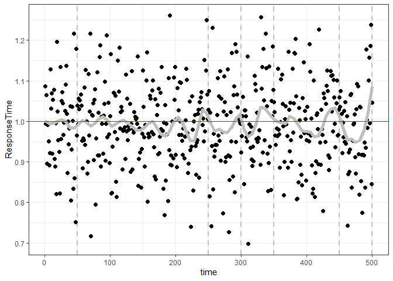
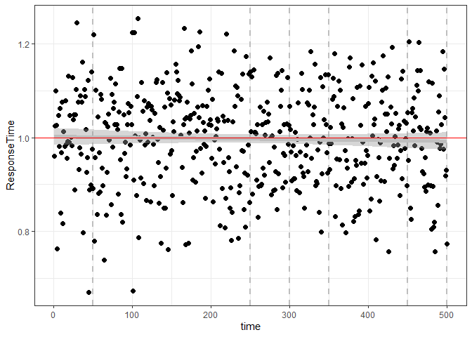
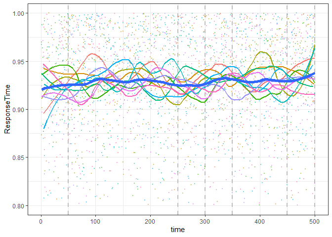
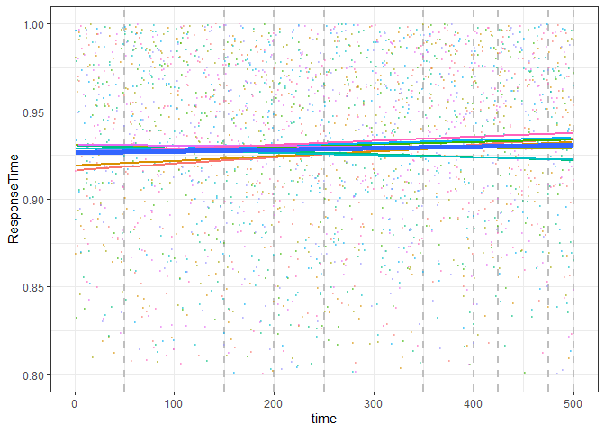
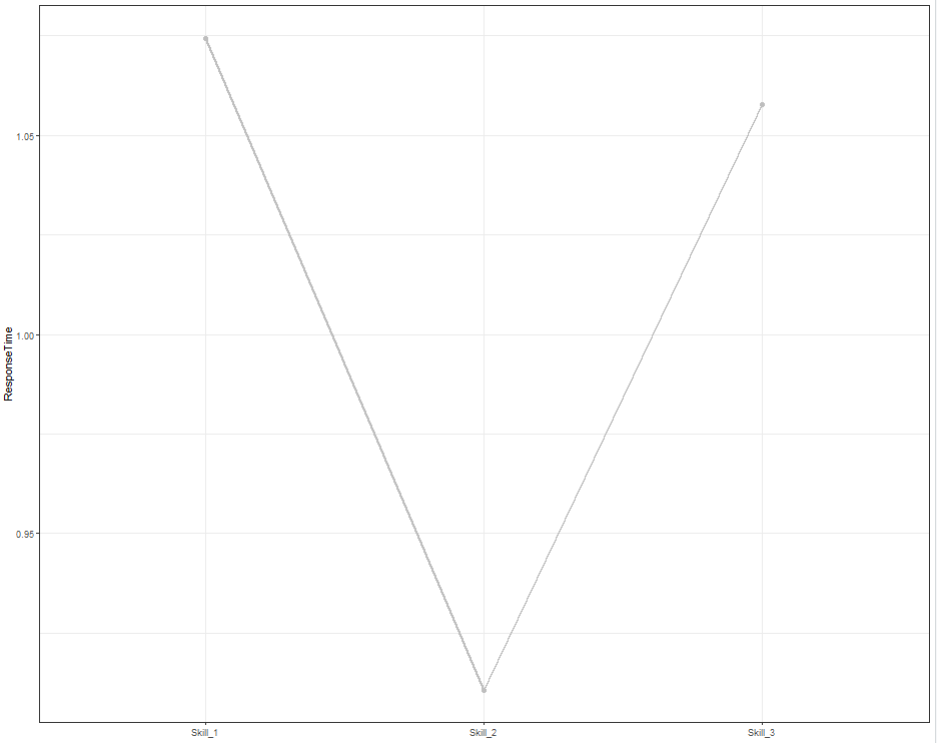
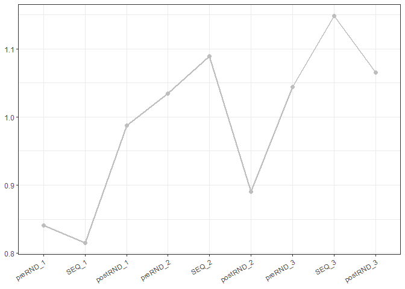

<!-- README.md is generated from README.Rmd. Please edit that file -->

# SRTTAnalysis 

<!-- badges: start -->

<!-- badges: end -->

This package includes a set of functions to analyse raw reaction time
data (e.g., SRTT), calculate performance and plot the results of this
analysis

## Installation

You can install the development version of SRTTAnalysis from
[GitHub](https://github.com/) with:

``` r
# install.packages("pak")
pak::pak("albertooof/SRTTAnalysis")
```

You can also install the development version of SRTTAnalysis from
[GitHub](https://github.com/) with:

``` r
# install.packages("devtools")
devtools::install_github("albertooof/SRTTAnalysis")
```

## Types of Dataframe expected as input


## Example

Basic examples which show you how to run the code and what output to
expect:

``` r
library(SRTTAnalysis)

data_wide <- data.frame(id = 999, t(rnorm(500, mean = 1, sd = 0.1)))
head(SRTT_analysis(data_wide, format = "Wide")[, 1:10])
#>       ID       V2       V3       V4       V5       V6       V7       V8
#> SRTT 999 922.3082 1069.686 1001.859 960.1777 996.0453 1115.328 1022.974
#>            V9      V10
#> SRTT 854.8067 987.9148
```

``` r

data_long <- data.frame(value = c(999, rnorm(500, mean = 1, sd = 0.1)))
head(SRTT_analysis(data_long, format = "Long")[, 1:10])
#>       ID       V2       V3       V4       V5       V6       V7       V8
#> SRTT 999 919.2633 1143.868 994.5852 1123.792 939.2245 1087.372 986.0247
#>            V9      V10
#> SRTT 1020.292 1021.148
```

``` r
ID <- LETTERS[1:10]

dataframe_wide <- data.frame(ID = ID, matrix(stats::rnorm(10 * 500, mean = 1, sd = 0.1), nrow = 10, ncol = 500) )

head(SRTT_analysis_for_Dataframes(dataframe_wide, format = "Wide")[, 1:10]) 
#>       ID               V2               V3               V4               V5
#> SRTT   A 957.553100113095 729.680032307336 1052.73079489181 943.232320758538
#> SRTT1  B  1040.1030480145 1077.65014177272  1007.4187506699 1020.35368569594
#> SRTT2  C 1052.26910875888 916.568409858215 888.967153027249 1017.15870467233
#> SRTT3  D 1028.12564522422 1084.74729741049 1215.98674230588 731.772565812653
#> SRTT4  E  1002.5374994894 1080.51943166513 1031.10401723884 886.955867764568
#> SRTT5  F 1126.18535145509 1131.26293206113  955.10072719462 1108.92188185147
#>                     V6               V7               V8               V9
#> SRTT  990.905078110544 991.666386877843 1014.74022089716 923.248298650838
#> SRTT1 1027.94797648955 893.336626621189 1056.28904749566  1046.2778007819
#> SRTT2  1055.4911978629 1122.12697731036 1152.29572839461 955.579133282384
#> SRTT3 953.543300026962 1006.34583324199 1042.87194462582 1164.54731014707
#> SRTT4 947.757129923073 903.861942373615 1057.61427014153 1056.30656831574
#> SRTT5  1022.1767753637 941.251913358941 1040.78754257363 1155.68406536069
#>                    V10
#> SRTT  1049.46656363865
#> SRTT1 1041.60031734424
#> SRTT2 1016.80618834952
#> SRTT3 965.692029904565
#> SRTT4 1027.13736807766
#> SRTT5 1093.78932735298
```

``` r

dataframe_long <- as.data.frame(t(dataframe_wide))

head(SRTT_analysis_for_Dataframes(dataframe_long, format = "Long" ,running_window_width_percentage = 0.3)[, 1:10]) 
#>       ID        V2        V3        V4        V5        V6        V7        V8
#> SRTT   A  957.5531    729.68 1052.7308  943.2323  990.9051  991.6664 1014.7402
#> SRTT1  B  1040.103 1077.6501 1007.4188 1020.3537  1027.948  893.3366  1056.289
#> SRTT2  C 1052.2691  916.5684  888.9672 1017.1587 1055.4912  1122.127 1152.2957
#> SRTT3  D 1028.1256 1084.7473 1215.9867  731.7726  953.5433 1006.3458 1042.8719
#> SRTT4  E 1002.5375 1080.5194  1031.104  886.9559  947.7571  903.8619 1057.6143
#> SRTT5  F 1126.1854 1131.2629  955.1007 1108.9219 1022.1768  941.2519 1040.7875
#>              V9       V10
#> SRTT   923.2483 1049.4666
#> SRTT1 1046.2778 1041.6003
#> SRTT2  955.5791 1016.8062
#> SRTT3 1164.5473   965.692
#> SRTT4 1056.3066 1027.1374
#> SRTT5 1155.6841 1093.7893
```

``` r
random_values <- stats::rnorm(1200, mean = 1, sd = 0.1)

num_nas <- sample(50:150, 1)

random_values[sample(1200, num_nas)] <- NA

random_list_w <- data.frame(ID = 999, t(random_values))

percentage_of_filtered_values(random_list_w, format = "Wide", number_of_rounds = 3,  rounds_of_equal_length = FALSE, design = c(50 , 180, 50, 50, 300, 50, 50 , 180, 50, 50 , 180, 50))
#>    ID preRND_1  Train_1 postRND_1  Skill_1 preRND_2  Train_2 postRND_2 Skill_2
#> 1 999       12 8.333333         8 8.928571       10 10.33333         6    9.75
#>   preRND_3  Train_3 postRND_3  Skill_3
#> 1        6 11.66667        10 10.35714
```

``` r
random_list_l <- as.data.frame(t(random_list_w))

percentage_of_filtered_values(random_list_l, format = "Long", number_of_rounds = 3,  rounds_of_equal_length = TRUE, design = c(40, 300, 60))
#>    ID preRND_1  Train_1 postRND_1 Skill_1 preRND_2 Train_2 postRND_2 Skill_2
#> 1 999     12.5 8.666667  6.666667    8.75     12.5       9        10     9.5
#>   preRND_3 Train_3 postRND_3 Skill_3
#> 1       10      10  8.333333    9.75
```

``` r
random_matrix <- matrix(stats::rnorm(10 * 1200, mean = 1, sd = 0.1), nrow = 10, ncol = 1200)

for (i in 1:10) { 
  num_nas <- sample(50:300, 1)
  random_matrix[i, sample(1200, num_nas)] <- NA 
  }

random_df_w <- data.frame(ID = LETTERS[1:10], random_matrix)

percentage_of_filtered_values_for_Dataframe(random_df_w, format = "Wide",number_of_rounds = 3, rounds_of_equal_length = FALSE, design = c(50 , 180, 50, 50, 300, 50, 50 , 180, 50, 50 , 180, 50))
#>    ID preRND_1          Train_1 postRND_1          Skill_1 preRND_2
#> 1   A       24 21.1111111111111        20 21.4285714285714       24
#> 2   B       12 12.7777777777778         6 11.4285714285714       12
#> 3   C        6 17.2222222222222        22 16.0714285714286       16
#> 4   D       16 10.5555555555556         4 10.3571428571429       12
#> 5   E       18 17.2222222222222        16 17.1428571428571       16
#> 6   F       22 16.6666666666667        18 17.8571428571429       18
#> 7   G       12                5         0 5.35714285714286        8
#> 8   H       16 10.5555555555556         6 10.7142857142857       16
#> 9   I        6               10        10 9.28571428571429        8
#> 10  J       22 17.2222222222222        20 18.5714285714286       24
#>             Train_2 postRND_2 Skill_2 preRND_3          Train_3 postRND_3
#> 1  16.3333333333333        14      17       18 16.1111111111111        20
#> 2  10.3333333333333        22      12        4 12.2222222222222         8
#> 3                18        16    17.5       18 17.2222222222222        14
#> 4                10         6    9.75       12 12.7777777777778         8
#> 5  12.6666666666667        18   13.75       14 14.4444444444444        16
#> 6  19.3333333333333        26      20        8 16.6666666666667        16
#> 7  5.66666666666667         4    5.75        8                5         4
#> 8  10.6666666666667         6   10.75       10 5.55555555555556        18
#> 9                10         6    9.25       12 8.88888888888889        10
#> 10 17.3333333333333        16      18       28 17.2222222222222        12
#>             Skill_3
#> 1  17.1428571428571
#> 2                10
#> 3  16.7857142857143
#> 4  11.7857142857143
#> 5  14.6428571428571
#> 6                15
#> 7  5.35714285714286
#> 8  8.57142857142857
#> 9  9.64285714285714
#> 10 18.2142857142857
```

``` r
random_df_l <- as.data.frame(t(random_df_w))

percentage_of_filtered_values_for_Dataframe(data = random_df_l,format = "Long", number_of_rounds = 3, rounds_of_equal_length = FALSE, design = c(50 , 180, 50, 50, 300, 50, 50 , 180, 50, 50 , 180, 50))
#>    ID preRND_1          Train_1 postRND_1          Skill_1 preRND_2
#> 1   A       24 21.1111111111111        20 21.4285714285714       24
#> 2   B       12 12.7777777777778         6 11.4285714285714       12
#> 3   C        6 17.2222222222222        22 16.0714285714286       16
#> 4   D       16 10.5555555555556         4 10.3571428571429       12
#> 5   E       18 17.2222222222222        16 17.1428571428571       16
#> 6   F       22 16.6666666666667        18 17.8571428571429       18
#> 7   G       12                5         0 5.35714285714286        8
#> 8   H       16 10.5555555555556         6 10.7142857142857       16
#> 9   I        6               10        10 9.28571428571429        8
#> 10  J       22 17.2222222222222        20 18.5714285714286       24
#>             Train_2 postRND_2 Skill_2 preRND_3          Train_3 postRND_3
#> 1  16.3333333333333        14      17       18 16.1111111111111        20
#> 2  10.3333333333333        22      12        4 12.2222222222222         8
#> 3                18        16    17.5       18 17.2222222222222        14
#> 4                10         6    9.75       12 12.7777777777778         8
#> 5  12.6666666666667        18   13.75       14 14.4444444444444        16
#> 6  19.3333333333333        26      20        8 16.6666666666667        16
#> 7  5.66666666666667         4    5.75        8                5         4
#> 8  10.6666666666667         6   10.75       10 5.55555555555556        18
#> 9                10         6    9.25       12 8.88888888888889        10
#> 10 17.3333333333333        16      18       28 17.2222222222222        12
#>             Skill_3
#> 1  17.1428571428571
#> 2                10
#> 3  16.7857142857143
#> 4  11.7857142857143
#> 5  14.6428571428571
#> 6                15
#> 7  5.35714285714286
#> 8  8.57142857142857
#> 9  9.64285714285714
#> 10 18.2142857142857
```

``` r
data_wide <- data.frame(id = 999, t(rnorm(1200, mean = 1, sd = 0.1)))

Calculate_Skill_Sequence(data_wide, format= "Wide" , rounds_of_equal_length = FALSE, design = c(50, 200, 50, 50, 300, 50, 50, 400, 50), span_random = 0.20,  span_training = 0.14, automatically_select_span = TRUE, size_of_trial_window_for_skill_same = TRUE, size_of_trial_window_for_skill_percentage = 0.15 , size_of_trial_window_for_skill_percentage_SEQ = 0.28, size_of_trial_window_for_skill_percentage_RND = 0.50)
#>    ID  preRND_1  Train_1 postRND_1   Skill_1  preRND_2  Train_2 postRND_2
#> 1 999 0.9936954 1.006779  1.016471 0.0096922 0.9899316 1.015508 0.9913646
#>       Skill_2 preRND_3   Train_3 postRND_3      Skill_3
#> 1 -0.02414339 1.010201 0.9945852 0.9886967 -0.005888494
```

``` r
data_long <- data.frame(value = c(999, rnorm(1200, mean = 1, sd = 0.1)))

skill <- Calculate_Skill_Sequence(data_long, format= "Long" , design = c(40, 300, 60), size_of_trial_window_for_skill_percentage = 0.10)

skill
#>    ID  preRND_1   Train_1 postRND_1      Skill_1  preRND_2  Train_2 postRND_2
#> 1 999 0.9978113 0.9853373 0.9837869 -0.001550443 0.9841733 1.005226 0.9801224
#>       Skill_2 preRND_3  Train_3 postRND_3     Skill_3
#> 1 -0.02510376 1.000517 1.041268 0.9909861 -0.05028153
```

``` r

random_matrix <- matrix(stats::rnorm(5 * 1200, mean = 1, sd = 0.1), nrow = 5, ncol = 1200)

random_df_w <- data.frame(ID = LETTERS[1:5], random_matrix)

skill_df <- Calculate_Skill_Sequence_for_Dataframes(data = random_df_w, format= "Wide" ,  rounds_of_equal_length = FALSE, design = c(50, 200, 50,  50, 300, 50,  50, 400, 50), span_random = 0.20,  span_training = 0.14, automatically_select_span = TRUE, size_of_trial_window_for_skill_same = TRUE, size_of_trial_window_for_skill_percentage = 0.15 , size_of_trial_window_for_skill_percentage_SEQ = 0.28, size_of_trial_window_for_skill_percentage_RND = 0.50)

skill_df 
#>   ID          preRND_1           Train_1         postRND_1             Skill_1
#> 1  A  0.97409412220588  1.01155186834322  1.03918977862502  0.0276379102818043
#> 2  B  1.00316682755275   1.0265042408967 0.967817512204036 -0.0586867286926631
#> 3  C 0.999308213202863  1.01388484994895 0.968146880242984  -0.045737969705966
#> 4  D  1.00222669512464 0.986037434018063  1.01322576432786  0.0271883303097922
#> 5  E  0.99956629089298  0.99367264527251 0.994784556229446 0.00111191095693641
#>            preRND_2           Train_2         postRND_2              Skill_2
#> 1 0.994475169064308 0.998394689610347  0.98911123058195 -0.00928345902839678
#> 2  1.01877737413122  1.00229380723418 0.994207224755961  -0.0080865824782228
#> 3  1.00501651006114  1.01974067363955  1.02925002866736  0.00950935502781425
#> 4  1.00305381661887  1.02100562197308 0.988575306242532  -0.0324303157305453
#> 5  1.01247967099128  1.00167241757528 0.977165584013001  -0.0245068335622834
#>            preRND_3           Train_3        postRND_3              Skill_3
#> 1 0.967960061702141  1.01523943837301 1.00057045389998  -0.0146689844730266
#> 2 0.973481086528618 0.990986524173168 0.99261237619975  0.00162585202658128
#> 3  1.02139501192656  1.00700827950366 1.00210935575017 -0.00489892375348977
#> 4 0.968469841581146 0.994088456141056 1.01295879473177   0.0188703385907141
#> 5  1.00992405883498 0.991367161942231 1.00180406483121   0.0104369028889802
```

``` r
random_df_l <- as.data.frame(t(random_df_w))

Calculate_Skill_Sequence_for_Dataframes(data = random_df_l, format= "Long" ,  number_of_rounds = 3, rounds_of_equal_length = TRUE, design = c(50, 300, 50), span_random = 0.10,  span_training = 0.4, automatically_select_span = FALSE, size_of_trial_window_for_skill_same = FALSE, size_of_trial_window_for_skill_percentage = 0.15 , size_of_trial_window_for_skill_percentage_SEQ = 0.8, size_of_trial_window_for_skill_percentage_RND = 0.50)
#>   ID          preRND_1           Train_1         postRND_1              Skill_1
#> 1  A 0.979580581356855  1.00642534875367  1.01871803225541   0.0122926835017414
#> 2  B 0.998441933316684  1.00233752059241 0.991790642392794  -0.0105468781996172
#> 3  C  1.00096180489605   1.0100319270462   1.0049849741779 -0.00504695286830792
#> 4  D  1.00682033859642 0.995884704823637 0.963166404894297  -0.0327182999293404
#> 5  E 0.996556346106032 0.999118784312729  1.00611418733333  0.00699540302059742
#>            preRND_2           Train_2         postRND_2              Skill_2
#> 1   1.0012030628787 0.983419486282861 0.969072896172394  -0.0143465901104669
#> 2 0.999151081918516 0.993107902238678 0.997047655500138  0.00393975326146012
#> 3  1.01648292884184  1.01547764393989   1.0205269913086  0.00504934736870744
#> 4 0.964757856666781 0.997168825369191 0.983070739774261  -0.0140980855949305
#> 5  1.04146881702323 0.998514864583614 0.992048393381681 -0.00646647120193378
#>            preRND_3           Train_3         postRND_3              Skill_3
#> 1  1.01278594826051  1.01460625689122  1.01033144426557 -0.00427481262564977
#> 2 0.992314601549892  0.99763813687198  1.00814073762878   0.0105026007568041
#> 3  1.01142036635879   1.0028781683997  1.00570928946658  0.00283112106687211
#> 4  1.00276401393252 0.991698532736023   0.9993499766571  0.00765144392107686
#> 5  1.00203763612532  0.99497647153768 0.990079238398079 -0.00489723313960166
```

``` r

random_list_w <- cbind(999, (as.data.frame(t(stats::rnorm(500, mean = 1, sd = 0.1)))))


png("plot1.png", width = 800, height = 600)

plot_data(random_list_w,format = "Wide" , limit_y_axis_min_max = TRUE,  limit_y_axis_lower = 0.5,  limit_y_axis_upper = 1.5,  design = c(50, 200, 50, 50, 100, 50), function_to_fit = "loess", span_loess_fitting = 0.1,   standard_error = FALSE, color_dots = "black",   color_line = "grey",  color_intercept = "grey")
#> `geom_smooth()` using formula = 'y ~ x'

dev.off()
#> png 
#>   2
```



``` r

random_list_l <- data.frame(value = c(999, rnorm(500, mean = 1, sd = 0.1)))

png("plot2.png", width = 800, height = 600)

plot_data(random_list_l, format = "Long" , limit_y_axis_min_max = TRUE,limit_y_axis_lower = 0.5,  limit_y_axis_upper = 1.5,  design = c(50, 200, 50, 50, 100, 50), function_to_fit = "lm",   span_loess_fitting = 0.1, standard_error = T,  color_dots = "black",  color_line = "grey",  color_intercept = "grey")
#> `geom_smooth()` using formula = 'y ~ x'

dev.off()
#> png 
#>   2
```



``` r

random_df_w <- data.frame( ID = LETTERS[1:10], matrix(stats::rnorm(10 * 500, mean = 1, sd = 0.1), nrow = 10, ncol = 500))

png("plot3.png", width = 800, height = 600)

plot_data_for_Dataframes(random_df_w, format = "Wide" , limit_y_axis_min_max = FALSE, limit_y_axis_lower = 0.8, limit_y_axis_upper = 1, design = c(50, 200, 50, 50, 100, 50), function_to_fit = "loess", span_loess_fitting = 0.25, standard_error = FALSE, color_dots = "black", color_line = "grey", color_intercept = "grey")
#> `geom_smooth()` using formula = 'y ~ x'
#> `geom_smooth()` using formula = 'y ~ x'

dev.off()
#> png 
#>   2
```



``` r

random_df_l <- as.data.frame(t(random_df_w))

png("plot4.png", width = 800, height = 600)

plot_data_for_Dataframes(random_df_l,format = "Long" ,  limit_y_axis_min_max = FALSE, limit_y_axis_lower = 0.8,   limit_y_axis_upper = 1,  design = c(50, 100, 50, 50, 100, 50,  25, 50, 25), function_to_fit = "lm",  span_loess_fitting = 0.25,   standard_error = FALSE,  color_dots = "black", color_line = "grey",  color_intercept = "grey")
#> `geom_smooth()` using formula = 'y ~ x'
#> `geom_smooth()` using formula = 'y ~ x'
```



``` r

png("plot5.png", width = 800, height = 600)

data_wide <- data.frame(id = 999, t(rnorm(12, mean = 1, sd = 0.1)))

names(data_wide) <- c("ID", "preRND1", "Train1", "postRND1", "Skill1", "preRND2", "Train2", "postRND2", "Skill2", "preRND3", "Train3", "postRND3", "Skill3")

plots <- plot_skills(data_wide, format = "Wide", col_line = "grey",col_dots = "grey")

plots$plot1


dev.off()
#> png 
#>   2
```



``` r

plots$plot2
```




``` r

png("plot6.png", width = 800, height = 600)

random_matrix <- matrix(stats::rnorm(5 * 12, mean = 1, sd = 0.1), nrow = 5, ncol = 12)

random_df_w <- data.frame(ID = LETTERS[1:5], random_matrix)

names(random_df_w) <- c("ID", "preRND1", "Train1", "postRND1", "Skill1", "preRND2", "Train2", "postRND2", "Skill2", "preRND3", "Train3", "postRND3", "Skill3")

plots <- plot_skills_for_Dataframes(random_df_w,  format = "Wide",   col_line = "blue", col_dots = "grey")

plots$plot1

dev.off()
#> png 
#>   2
```


``` r
random_df_l <- as.data.frame(t(random_df_w))
plots <- plot_skills_for_Dataframes(random_df_l,  format = "Long",  col_line = "blue",   col_dots = "grey")
plots$plot2
```


