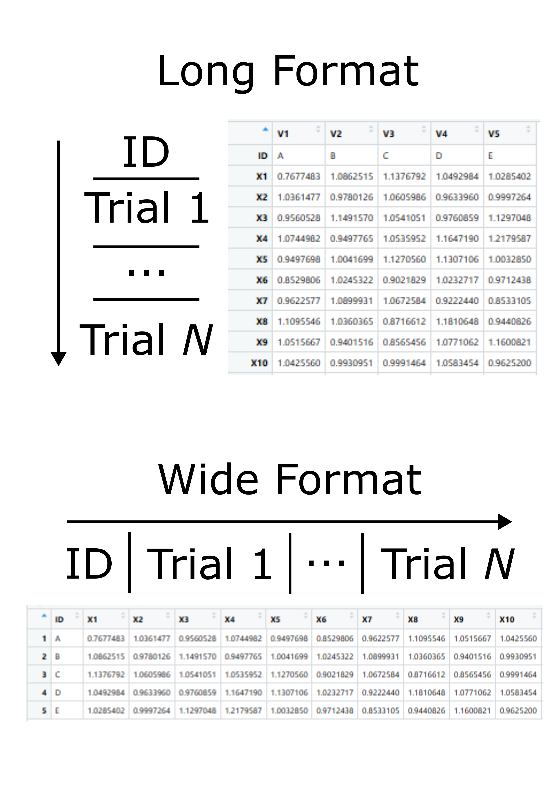
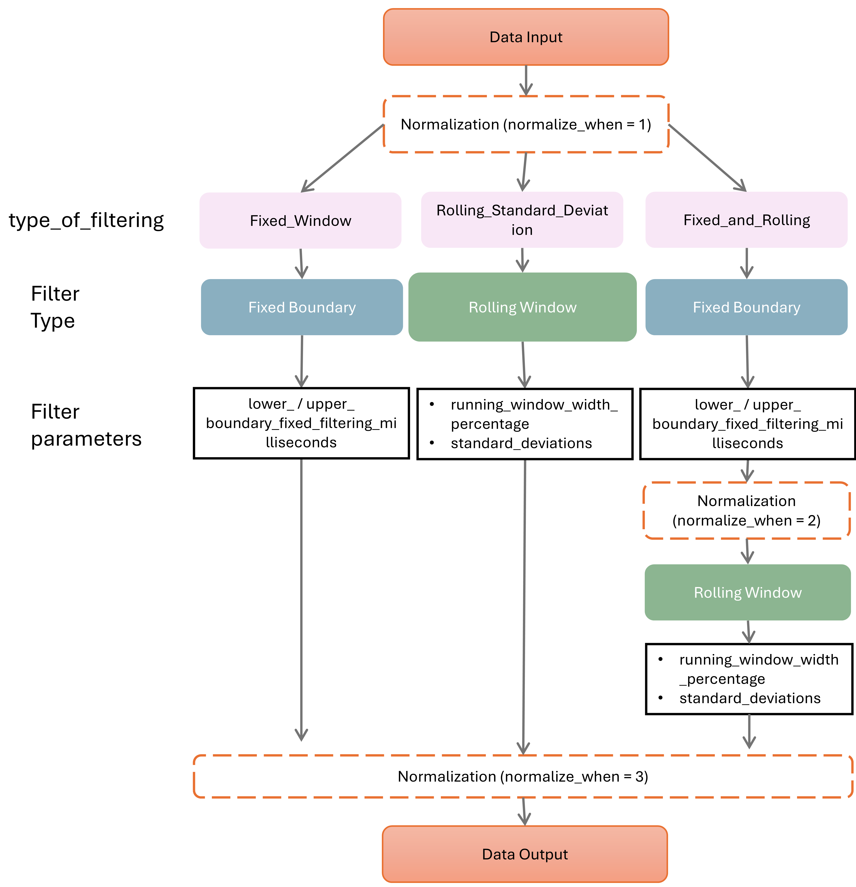
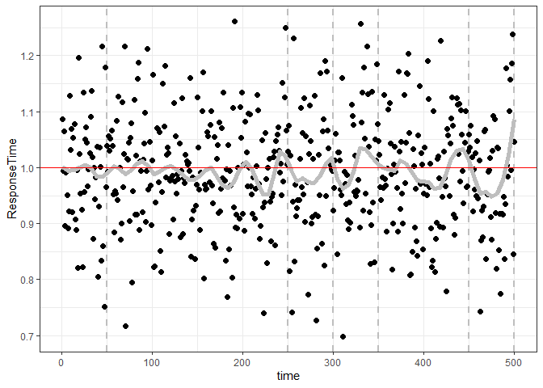
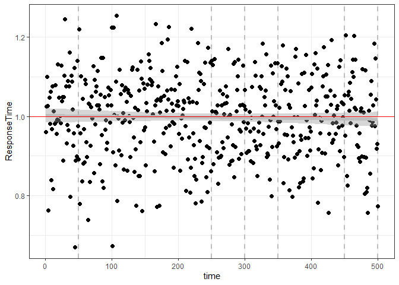
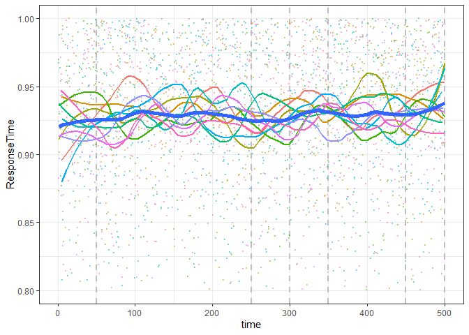
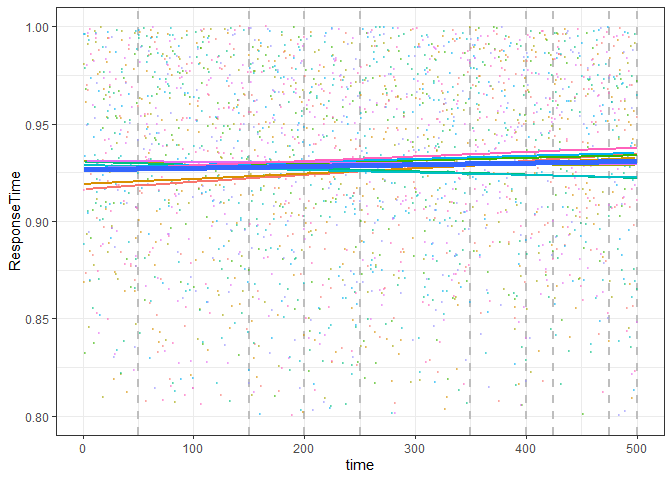
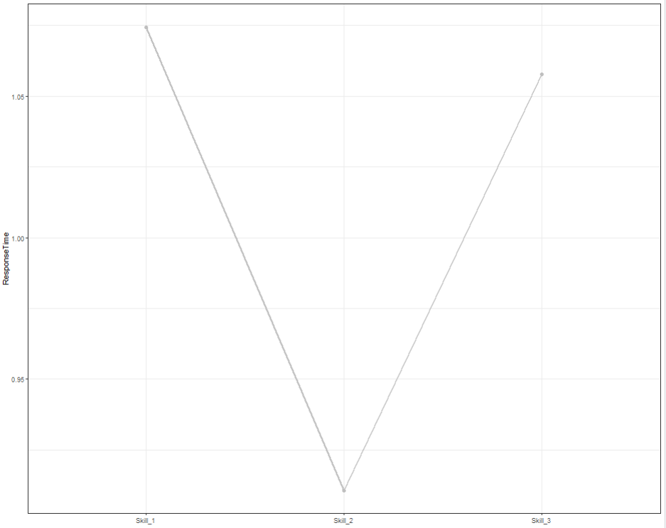
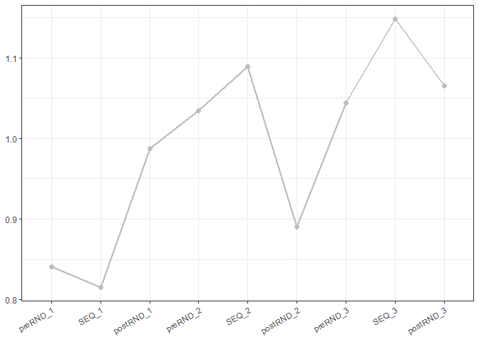

<!-- README.md is generated from README.Rmd. Please edit that file -->

# SRTTAnalysis 

<!-- badges: start -->

<!-- badges: end -->

This package includes a set of functions to analyse raw reaction time
data (e.g., SRTT), calculate performance and plot the results of this
analysis

## Installation

You can install the development version of SRTTAnalysis from
[GitHub](https://github.com/) with:

``` r
# install.packages("pak")
pak::pak("albertooof/SRTTAnalysis")
```

You can also install the development version of SRTTAnalysis from
[GitHub](https://github.com/) with:

``` r
# install.packages("devtools")
devtools::install_github("albertooof/SRTTAnalysis")
```

## Types of Dataframe expected as input



## Visual summary for SRTT_analysis function



## Example

Basic examples which show you how to run the code and what output to
expect:

``` r
library(SRTTAnalysis)

data_wide <- data.frame(id = 999, t(rnorm(500, mean = 1, sd = 0.1)))
head(SRTT_analysis(data_wide, format = "Wide", normalize_when = 2, normalize_type = "min_max")[, 1:10])
#>       ID        V2        V3        V4        V5       V6        V7       V8
#> SRTT 999 0.7240987 0.3744428 0.4147693 0.5813126 0.616279 0.4545307 0.392401
#>          V9       V10
#> SRTT 0.7739 0.6573538
```

``` r

data_long <- data.frame(value = c(999, rnorm(500, mean = 1, sd = 0.1)))
head(SRTT_analysis(data_long, format = "Long",  normalize_when = 1, normalize_type = "z_score", lower_boundary_fixed_filtering_milliseconds = -2, upper_boundary_fixed_filtering_milliseconds = 2)[, 1:10])
#>       ID        V2        V3       V4         V5          V6        V7 V8
#> SRTT 999 0.7018019 0.4033435 1.053031 -0.1422688 -0.07355932 0.2552072 NA
#>            V9 V10
#> SRTT 0.212531  NA
```

``` r
ID <- LETTERS[1:10]

dataframe_wide <- data.frame(ID = ID, matrix(stats::rnorm(10 * 500, mean = 1, sd = 0.1), nrow = 10, ncol = 500) )

head(SRTT_analysis_for_Dataframes(dataframe_wide, format = "Wide", normalize_when = 3, normalize_type = "min_max", type_of_filtering = "Rolling_Standard_Deviation")[, 1:10])
#>       ID                V2                V3                V4
#> SRTT   A 0.629992437256283 0.415793374961479                 0
#> SRTT1  B 0.303949905621383 0.346701520359848 0.544324135583348
#> SRTT2  C 0.411078597437151 0.205014086256813 0.763666712263356
#> SRTT3  D 0.987914336899354 0.421453309922332 0.506885418622253
#> SRTT4  E 0.315239743197274 0.422757740332729 0.751457548119264
#> SRTT5  F 0.453772033377487  0.23644296637139 0.494602576136155
#>                      V5                V6                 V7                V8
#> SRTT   0.62134057928484  0.47992104953304  0.575080812798604 0.679463838925164
#> SRTT1 0.698220859115058  0.71412792933478  0.630045525837948 0.773172610860024
#> SRTT2 0.102753475986079 0.576704871004943  0.594575969228536 0.563772881997088
#> SRTT3 0.509792003620483  0.21906813134839 0.0774083499460781 0.698018998233181
#> SRTT4  0.37320238585785 0.648029170373605  0.238518352963329 0.497180329446443
#> SRTT5 0.445877896498261 0.645316286605664  0.499445803770394  0.30066305973328
#>                      V9               V10
#> SRTT  0.781295872285297 0.474791858060307
#> SRTT1  0.30113108946632 0.857182687637821
#> SRTT2 0.255248914334895 0.644980213577959
#> SRTT3 0.468909773494827 0.627231602465031
#> SRTT4 0.691995087241334 0.716385937617025
#> SRTT5 0.508255484925863 0.382824038132154
```

``` r

dataframe_long <- as.data.frame(t(dataframe_wide))

head(SRTT_analysis_for_Dataframes(dataframe_long, format = "Long" ,running_window_width_percentage = 0.3)[, 1:10]) 
#>       ID        V2       V3        V4        V5        V6        V7        V8
#> SRTT   A 1075.6519 927.7258  640.5785 1069.6769  972.0125 1037.7299 1109.8169
#> SRTT1  B  891.0215 913.6832 1018.4389 1100.0164 1108.4484  1063.878 1139.7467
#> SRTT2  C  938.5215 820.7964 1139.9559  762.3747 1033.1442  1043.354 1025.7561
#> SRTT3  D 1249.0312 938.2611  985.1306  986.7252  827.2291  749.5122 1089.9897
#> SRTT4  E  910.3538 969.3588 1149.7464  942.1632 1092.9858  868.2498 1010.2012
#> SRTT5  F  987.8649 880.4666 1008.0422  983.9638  1082.521 1010.4356  912.2024
#>              V9       V10
#> SRTT  1180.1422  968.4702
#> SRTT1  889.5273 1184.2787
#> SRTT2  849.4957   1072.15
#> SRTT3  964.2965 1051.1546
#> SRTT4 1117.1139 1130.4994
#> SRTT5 1014.7891  952.8042
```

``` r
random_values <- stats::rnorm(1200, mean = 1, sd = 0.1)

num_nas <- sample(50:150, 1)

random_values[sample(1200, num_nas)] <- NA

random_list_w <- data.frame(ID = 999, t(random_values))

percentage_of_filtered_values(random_list_w, format = "Wide", number_of_rounds = 3,  rounds_of_equal_length = FALSE, design = c(50 , 180, 50, 50, 300, 50, 50 , 180, 50, 50 , 180, 50))
#>    ID preRND_1  Train_1 postRND_1  Skill_1 preRND_2  Train_2 postRND_2 Skill_2
#> 1 999        8 8.333333        12 8.928571        8 4.666667         0     4.5
#>   preRND_3  Train_3 postRND_3  Skill_3
#> 1        2 7.222222        12 7.142857
```

``` r
random_list_l <- as.data.frame(t(random_list_w))

percentage_of_filtered_values(random_list_l, format = "Long", number_of_rounds = 3,  rounds_of_equal_length = TRUE, design = c(40, 300, 60))
#>    ID preRND_1  Train_1 postRND_1 Skill_1 preRND_2 Train_2 postRND_2 Skill_2
#> 1 999      7.5 8.666667  8.333333     8.5        0       4  8.333333    4.25
#>   preRND_3  Train_3 postRND_3 Skill_3
#> 1        0 8.666667  3.333333       7
```

``` r
random_matrix <- matrix(stats::rnorm(10 * 1200, mean = 1, sd = 0.1), nrow = 10, ncol = 1200)

for (i in 1:10) { 
  num_nas <- sample(50:300, 1)
  random_matrix[i, sample(1200, num_nas)] <- NA 
  }

random_df_w <- data.frame(ID = LETTERS[1:10], random_matrix)

percentage_of_filtered_values_for_Dataframe(random_df_w, format = "Wide",number_of_rounds = 3, rounds_of_equal_length = FALSE, design = c(50 , 180, 50, 50, 300, 50, 50 , 180, 50, 50 , 180, 50))
#>    ID preRND_1          Train_1 postRND_1          Skill_1 preRND_2
#> 1   A       20 26.6666666666667        16 23.5714285714286       30
#> 2   B       32 22.7777777777778        22 24.2857142857143       16
#> 3   C       18 15.5555555555556        18 16.4285714285714       24
#> 4   D       12 11.1111111111111        10 11.0714285714286        8
#> 5   E       24 17.2222222222222        14 17.8571428571429       10
#> 6   F       22               15        20 17.1428571428571       12
#> 7   G       10 14.4444444444444        10 12.8571428571429       16
#> 8   H       10 17.7777777777778        34 19.2857142857143       10
#> 9   I       14 8.33333333333333        10 9.64285714285714       10
#> 10  J       10                5        12 7.14285714285714        6
#>             Train_2 postRND_2 Skill_2 preRND_3          Train_3 postRND_3
#> 1  19.6666666666667        30   22.25       26 26.6666666666667        28
#> 2                21        18      20       30               25        32
#> 3                23        24   23.25       24 17.7777777777778        22
#> 4  13.6666666666667        12   12.75       16 19.4444444444444        18
#> 5  21.3333333333333        12   18.75       14 20.5555555555556         6
#> 6  19.6666666666667        26    19.5       22 18.3333333333333        18
#> 7  10.6666666666667        10   11.25       12 9.44444444444444         6
#> 8  16.3333333333333        16    15.5       18 15.5555555555556        18
#> 9  9.66666666666667         6    9.25       12 7.77777777777778         6
#> 10 5.66666666666667        10    6.25        8 7.77777777777778        16
#>             Skill_3
#> 1  26.7857142857143
#> 2  27.1428571428571
#> 3  19.6428571428571
#> 4  18.5714285714286
#> 5  16.7857142857143
#> 6  18.9285714285714
#> 7  9.28571428571429
#> 8  16.4285714285714
#> 9  8.21428571428571
#> 10 9.28571428571429
```

``` r
random_df_l <- as.data.frame(t(random_df_w))

percentage_of_filtered_values_for_Dataframe(data = random_df_l,format = "Long", number_of_rounds = 3, rounds_of_equal_length = FALSE, design = c(50 , 180, 50, 50, 300, 50, 50 , 180, 50, 50 , 180, 50))
#>    ID preRND_1          Train_1 postRND_1          Skill_1 preRND_2
#> 1   A       20 26.6666666666667        16 23.5714285714286       30
#> 2   B       32 22.7777777777778        22 24.2857142857143       16
#> 3   C       18 15.5555555555556        18 16.4285714285714       24
#> 4   D       12 11.1111111111111        10 11.0714285714286        8
#> 5   E       24 17.2222222222222        14 17.8571428571429       10
#> 6   F       22               15        20 17.1428571428571       12
#> 7   G       10 14.4444444444444        10 12.8571428571429       16
#> 8   H       10 17.7777777777778        34 19.2857142857143       10
#> 9   I       14 8.33333333333333        10 9.64285714285714       10
#> 10  J       10                5        12 7.14285714285714        6
#>             Train_2 postRND_2 Skill_2 preRND_3          Train_3 postRND_3
#> 1  19.6666666666667        30   22.25       26 26.6666666666667        28
#> 2                21        18      20       30               25        32
#> 3                23        24   23.25       24 17.7777777777778        22
#> 4  13.6666666666667        12   12.75       16 19.4444444444444        18
#> 5  21.3333333333333        12   18.75       14 20.5555555555556         6
#> 6  19.6666666666667        26    19.5       22 18.3333333333333        18
#> 7  10.6666666666667        10   11.25       12 9.44444444444444         6
#> 8  16.3333333333333        16    15.5       18 15.5555555555556        18
#> 9  9.66666666666667         6    9.25       12 7.77777777777778         6
#> 10 5.66666666666667        10    6.25        8 7.77777777777778        16
#>             Skill_3
#> 1  26.7857142857143
#> 2  27.1428571428571
#> 3  19.6428571428571
#> 4  18.5714285714286
#> 5  16.7857142857143
#> 6  18.9285714285714
#> 7  9.28571428571429
#> 8  16.4285714285714
#> 9  8.21428571428571
#> 10 9.28571428571429
```

``` r
data_wide <- data.frame(id = 999, t(rnorm(1200, mean = 1, sd = 0.1)))

Calculate_Skill_Sequence(data_wide, format= "Wide" , rounds_of_equal_length = FALSE, design = c(50, 200, 50, 50, 300, 50, 50, 400, 50), span_random = 0.20,  span_training = 0.14, automatically_select_span = TRUE, size_of_trial_window_for_skill_same = TRUE, size_of_trial_window_for_skill_percentage = 0.15 , size_of_trial_window_for_skill_percentage_SEQ = 0.28, size_of_trial_window_for_skill_percentage_RND = 0.50)
#>    ID  preRND_1  Train_1 postRND_1     Skill_1 preRND_2  Train_2 postRND_2
#> 1 999 0.9658231 1.012848   1.02142 0.008571595 1.001716 1.014136  1.009368
#>        Skill_2  preRND_3  Train_3 postRND_3      Skill_3
#> 1 -0.004767806 0.9832371 1.006542 0.9966184 -0.009924001
```

``` r
data_long <- data.frame(value = c(999, rnorm(1200, mean = 1, sd = 0.1)))

skill <- Calculate_Skill_Sequence(data_long, format= "Long" , design = c(40, 300, 60), size_of_trial_window_for_skill_percentage = 0.10)

skill
#>    ID  preRND_1  Train_1 postRND_1      Skill_1 preRND_2  Train_2 postRND_2
#> 1 999 0.9705488 1.002267 0.9952277 -0.007039282 1.003144 1.025362  1.026721
#>       Skill_2 preRND_3   Train_3 postRND_3    Skill_3
#> 1 0.001359564 1.017946 0.9711469  1.007868 0.03672076
```

``` r

random_matrix <- matrix(stats::rnorm(5 * 1200, mean = 1, sd = 0.1), nrow = 5, ncol = 1200)

random_df_w <- data.frame(ID = LETTERS[1:5], random_matrix)

skill_df <- Calculate_Skill_Sequence_for_Dataframes(data = random_df_w, format= "Wide" ,  rounds_of_equal_length = FALSE, design = c(50, 200, 50,  50, 300, 50,  50, 400, 50), span_random = 0.20,  span_training = 0.14, automatically_select_span = TRUE, size_of_trial_window_for_skill_same = TRUE, size_of_trial_window_for_skill_percentage = 0.15 , size_of_trial_window_for_skill_percentage_SEQ = 0.28, size_of_trial_window_for_skill_percentage_RND = 0.50)

skill_df 
#>   ID          preRND_1           Train_1         postRND_1
#> 1  A 0.970179381325615  1.01391342705216 0.971771507136888
#> 2  B 0.982741970980276 0.980248088239897 0.979451308962901
#> 3  C   0.9937104330652 0.984232132390787 0.967868090005441
#> 4  D 0.980642622502746 0.993791439566336  1.00380698477123
#> 5  E 0.991419808056067  1.00081423682055 0.999921458294299
#>                 Skill_1          preRND_2           Train_2         postRND_2
#> 1   -0.0421419199152669  1.00471994686865 0.987036829064803  1.03489354280951
#> 2 -0.000796779276995618  1.00145066564293  1.01014446646232 0.997571177776307
#> 3   -0.0163640423853455  1.00811128242978 0.995002069593181  1.00159986952317
#> 4    0.0100155452048942 0.987756391933176  1.00220640161125 0.990646799555894
#> 5 -0.000892778526249804  1.00897228003798 0.989583010185371  1.00778303904333
#>               Skill_2          preRND_3           Train_3         postRND_3
#> 1  0.0478567137447033 0.993946541395147 0.985145845610978 0.993974502584276
#> 2 -0.0125732886860166  0.99920712977336 0.983029926935773    1.005149766771
#> 3 0.00659779992999054 0.990528978561343  1.00246605501755  1.00861684892659
#> 4 -0.0115596020553551  1.00638424980378 0.999520988885997  0.98395508148519
#> 5   0.018200028857963 0.983668084802541 0.994566948501957  1.02177618675651
#>               Skill_3
#> 1 0.00882865697329882
#> 2  0.0221198398352246
#> 3 0.00615079390904083
#> 4 -0.0155659074008074
#> 5  0.0272092382545518
```

``` r
random_df_l <- as.data.frame(t(random_df_w))

Calculate_Skill_Sequence_for_Dataframes(data = random_df_l, format= "Long" ,  number_of_rounds = 3, rounds_of_equal_length = TRUE, design = c(50, 300, 50), span_random = 0.10,  span_training = 0.4, automatically_select_span = FALSE, size_of_trial_window_for_skill_same = FALSE, size_of_trial_window_for_skill_percentage = 0.15 , size_of_trial_window_for_skill_percentage_SEQ = 0.8, size_of_trial_window_for_skill_percentage_RND = 0.50)
#>   ID          preRND_1           Train_1         postRND_1
#> 1  A   0.9722143201524 0.997783601774958 0.984233305864021
#> 2  B 0.974432906897433  1.00149877110695 0.998896186617229
#> 3  C 0.992712026586024  1.00275886066702  0.97951754229421
#> 4  D 0.983703405397282 0.996560301987364 0.997751953175125
#> 5  E  0.98468364662417 0.996697563843304 0.996052653554372
#>                 Skill_1          preRND_2           Train_2         postRND_2
#> 1   -0.0135502959109376   1.0185408981861  1.00265649762581  1.00766677038384
#> 2  -0.00260258448972539 0.984581141583171  1.00015291920187 0.999823374002267
#> 3    -0.023241318372806  1.01616415698766  1.00142029981699  1.00085768254829
#> 4    0.0011916511877611 0.982885612975662  1.00193994078892  1.00382675623128
#> 5 -0.000644910288932654  1.00208438670612 0.994667466348557 0.994526412709311
#>                 Skill_2          preRND_3           Train_3         postRND_3
#> 1    0.0050102727580299 0.997410783697448 0.997236549576095  0.97001211661106
#> 2 -0.000329545199601711 0.996178136410923 0.996628160351108 0.999779870763514
#> 3 -0.000562617268700993  1.00828908548277  1.00417689136529 0.994377803197029
#> 4   0.00188681544235703 0.984835998737975 0.996808276476152 0.990297278666073
#> 5 -0.000141053639245881 0.975929593438158  1.00386490067768   1.0297842282923
#>                Skill_3
#> 1  -0.0272244329650353
#> 2  0.00315171041240514
#> 3  -0.0097990881682567
#> 4 -0.00651099781007913
#> 5   0.0259193276146159
```

``` r

random_list_w <- cbind(999, (as.data.frame(t(stats::rnorm(500, mean = 1, sd = 0.1)))))

plot_data(random_list_w,format = "Wide" , limit_y_axis_min_max = TRUE,  limit_y_axis_lower = 0.5,  limit_y_axis_upper = 1.5,  design = c(50, 200, 50, 50, 100, 50), function_to_fit = "loess", span_loess_fitting = 0.1,   standard_error = FALSE, color_dots = "black",   color_line = "grey",  color_intercept = "grey")
```



``` r

random_list_l <- data.frame(value = c(999, rnorm(500, mean = 1, sd = 0.1)))

plot_data(random_list_l, format = "Long" , limit_y_axis_min_max = TRUE,limit_y_axis_lower = 0.5,  limit_y_axis_upper = 1.5,  design = c(50, 200, 50, 50, 100, 50), function_to_fit = "lm",   span_loess_fitting = 0.1, standard_error = T,  color_dots = "black",  color_line = "grey",  color_intercept = "grey")
```



``` r

random_df_w <- data.frame( ID = LETTERS[1:10], matrix(stats::rnorm(10 * 500, mean = 1, sd = 0.1), nrow = 10, ncol = 500))

plot_data_for_Dataframes(random_df_w, format = "Wide" , limit_y_axis_min_max = FALSE, limit_y_axis_lower = 0.8, limit_y_axis_upper = 1, design = c(50, 200, 50, 50, 100, 50), function_to_fit = "loess", span_loess_fitting = 0.25, standard_error = FALSE, color_dots = "black", color_line = "grey", color_intercept = "grey")
```



``` r

random_df_l <- as.data.frame(t(random_df_w))

plot_data_for_Dataframes(random_df_l,format = "Long" ,  limit_y_axis_min_max = FALSE, limit_y_axis_lower = 0.8,   limit_y_axis_upper = 1,  design = c(50, 100, 50, 50, 100, 50,  25, 50, 25), function_to_fit = "lm",  span_loess_fitting = 0.25,   standard_error = FALSE,  color_dots = "black", color_line = "grey",  color_intercept = "grey")
```



``` r

data_wide <- data.frame(id = 999, t(rnorm(12, mean = 1, sd = 0.1)))

names(data_wide) <- c("ID", "preRND1", "Train1", "postRND1", "Skill1", "preRND2", "Train2", "postRND2", "Skill2", "preRND3", "Train3", "postRND3", "Skill3")

plots <- plot_skills(data_wide, format = "Wide", col_line = "grey",col_dots = "grey")

plots$plot1
```



``` r

plots$plot2
```



``` r

random_matrix <- matrix(stats::rnorm(5 * 12, mean = 1, sd = 0.1), nrow = 5, ncol = 12)

random_df_w <- data.frame(ID = LETTERS[1:5], random_matrix)

names(random_df_w) <- c("ID", "preRND1", "Train1", "postRND1", "Skill1", "preRND2", "Train2", "postRND2", "Skill2", "preRND3", "Train3", "postRND3", "Skill3")

plots <- plot_skills_for_Dataframes(random_df_w,  format = "Wide",   col_line = "blue", col_dots = "grey")

plots$plot1
```


``` r
random_df_l <- as.data.frame(t(random_df_w))

plots <- plot_skills_for_Dataframes(random_df_l,  format = "Long",  col_line = "blue",   col_dots = "grey")

plots$plot2
```


